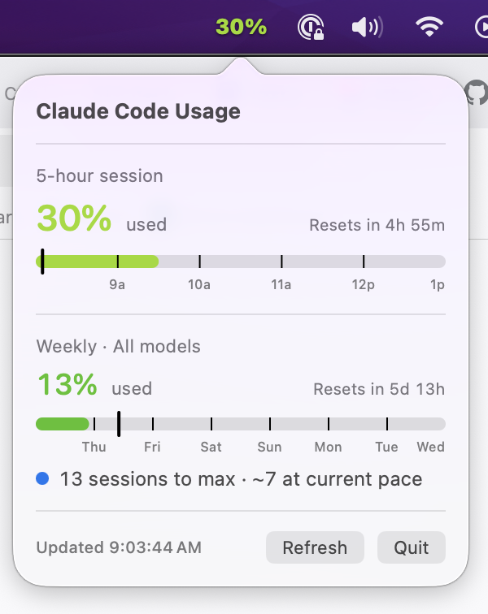

# Claude Code Usage (menubar)

A tiny macOS menubar app that shows how much Claude Code session quota you have
left, color-coded.



- Menubar text: percentage **used** in your current 5-hour session.
- Color is a smooth gradient keyed to usage: **green** (0%) → **yellow** (50%)
  → **orange** (70%) → **red** (90%) → **dark red** (100%). The same ramp colors
  the bars and the big percentages in the popover.
- Click the icon for: percent used in the 5-hour window with reset countdown,
  the weekly total + reset countdown, and per-model weekly (Opus / Sonnet) where
  your plan exposes them.
- Each bar has labeled gridlines (clock hours on the 5-hour bar, weekday names on
  the weekly bar) and a "you are here" tick showing how far you are through the
  window — fill past the tick means you're burning quota faster than the clock.
- The weekly section also shows a pace line: how many maxed sessions you'd need to
  hit 100%, and how many you're on track for at your current burn rate.
- Refreshes about every two minutes (rate-limit aware, so it stays under
  Anthropic's usage-endpoint cap).
- OAuth access tokens are refreshed automatically (proactively when expired,
  or on a 401 from the usage endpoint), and the rotated tokens are written
  back to the same Keychain item Claude Code uses.

## How it gets the data

It reuses your already-authenticated Claude Code session — no separate login,
no cookie copying. On each refresh it:

1. Reads the OAuth token from your macOS Keychain item `Claude Code-credentials`
   (the same item Claude Code itself writes), by shelling out to
   `/usr/bin/security` — which is already on that item's trusted-app list, so it
   doesn't trigger an extra Keychain prompt.
2. Calls `https://api.anthropic.com/api/oauth/usage` with that token.
3. Parses `five_hour`, `seven_day`, `seven_day_opus`, `seven_day_sonnet`.

Because the read goes through `/usr/bin/security` (already trusted on that
keychain item), it normally won't prompt at all. If macOS does show a Keychain
Access dialog asking permission to read `Claude Code-credentials`, click
**Always Allow** and it'll be silent thereafter.

If you've never signed into Claude Code on this Mac, the app will show an
error in its popup explaining the credentials weren't found.

## Build

Requires macOS 14+ and Xcode 15 / Swift 5.9+.

### One-time: create a code signing identity

The build signs the app with a self-signed identity so the Keychain ACL on
`Claude Code-credentials` stays valid across rebuilds. Without this, every
`./build-app.sh` produces a different cdhash and macOS treats it as a "new
app" — you'd have to click **Always Allow** on every rebuild, and stale
entries pile up in the keychain item's ACL.

In **Keychain Access.app**: menu → *Certificate Assistant* → *Create a
Certificate…*

- **Name:** `ClaudeUsage Self-Signed`
- **Identity Type:** Self Signed Root
- **Certificate Type:** Code Signing
- Check **Let me override defaults**, then bump **Validity Period** to
  something long (e.g. 3650 days) — when the cert expires, codesign
  verification fails and you'll start getting prompts again.

The cert and its private key land in your login keychain. You only do this
once per machine.

### Build the app

```bash
./build-app.sh
open ./ClaudeUsage.app
```

The script:
- runs `swift build -c release`
- assembles `ClaudeUsage.app/` with a proper `Info.plist` (`LSUIElement` so it
  doesn't show in the Dock)
- code-signs with the `ClaudeUsage Self-Signed` identity (override via
  `SIGN_IDENTITY=… ./build-app.sh` if you used a different cert name)

The signature pins the Keychain ACL to the cert's hash, so the ACL entry
survives any number of rebuilds as long as you keep using the same cert.

For development you can also just `swift run`, but that produces an unsigned
binary — the menubar still works (the app calls
`NSApplication.setActivationPolicy(.accessory)`), but you'll be prompted on
the first keychain read of every fresh `swift run` invocation.

## Install

After `./build-app.sh`:

```bash
# Move into /Applications
mv ClaudeUsage.app /Applications/

# Register a per-user LaunchAgent so it starts at login (and auto-restarts
# on crash, but not when you quit it from the menu).
mkdir -p ~/Library/LaunchAgents
cat > ~/Library/LaunchAgents/com.jakemoffatt.claudeusage.plist <<'PLIST'
<?xml version="1.0" encoding="UTF-8"?>
<!DOCTYPE plist PUBLIC "-//Apple//DTD PLIST 1.0//EN" "http://www.apple.com/DTDs/PropertyList-1.0.dtd">
<plist version="1.0">
<dict>
  <key>Label</key>
  <string>com.jakemoffatt.claudeusage</string>
  <key>ProgramArguments</key>
  <array>
    <string>/Applications/ClaudeUsage.app/Contents/MacOS/ClaudeUsage</string>
  </array>
  <key>RunAtLoad</key>
  <true/>
  <key>KeepAlive</key>
  <dict><key>SuccessfulExit</key><false/></dict>
  <key>ProcessType</key>
  <string>Interactive</string>
  <key>StandardOutPath</key>
  <string>/tmp/claudeusage.out.log</string>
  <key>StandardErrorPath</key>
  <string>/tmp/claudeusage.err.log</string>
</dict>
</plist>
PLIST

# Bootstrap the agent (starts the app immediately and at every login).
launchctl bootstrap gui/$(id -u) ~/Library/LaunchAgents/com.jakemoffatt.claudeusage.plist
```

The first time it runs, macOS may show one Keychain Access dialog asking
to read `Claude Code-credentials`. Click **Always Allow** and it'll be
silent thereafter.

The LaunchAgent shows up in **System Settings → General → Login Items →
Allow in the Background** (toggleable from the UI if you want to disable
it temporarily).

## Uninstall

```bash
launchctl bootout gui/$(id -u)/com.jakemoffatt.claudeusage
rm ~/Library/LaunchAgents/com.jakemoffatt.claudeusage.plist
rm -rf /Applications/ClaudeUsage.app
```

## Notes

- The 5-hour and weekly *limits* are enforced server-side by Anthropic. This
  app just reads the percentage Anthropic returns; it does not compute its
  own session windows from local JSONL.
- The keychain read shells out to `/usr/bin/security` rather than calling
  `SecItemCopyMatching` directly. On macOS 15+ this is what keeps the ACL
  "Always Allow" sticky across token rotations without re-prompting.
