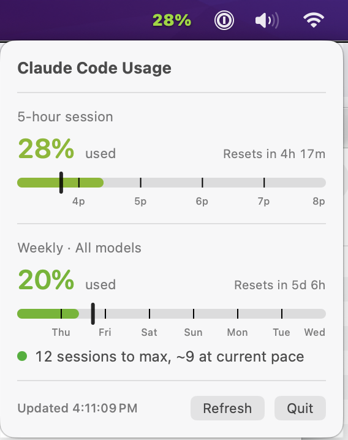
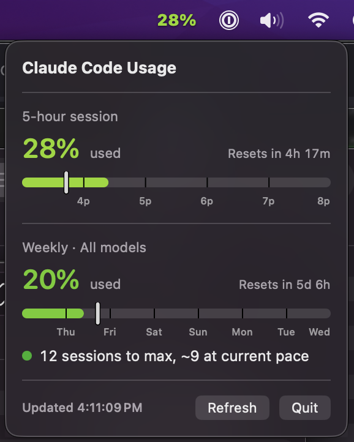

# Claude Code Usage (menubar)

A tiny macOS menubar app that shows how much Claude Code session quota you have
left, color-coded. Also runs on Linux: the same package builds a headless
`claude-usage` CLI plus a KDE Plasma panel widget — see
[Linux (KDE Plasma)](#linux-kde-plasma).

**[Download the latest release](https://github.com/python2121/claude-usage/releases/latest)**
(DMG — drag into Applications), or see the
[project page](https://python2121.github.io/claude-usage/). The app is
self-signed, so the first launch needs a one-time approval: open the app, then
System Settings → Privacy & Security → **Open Anyway** (or clear quarantine
yourself with `xattr -cr /Applications/ClaudeUsage.app`). To have it start at
login, add it under System Settings → General → Login Items. Prefer building
from source? See [Build](#build) below.

The popover adapts to your macOS version's window styling. On **macOS Tahoe (26)
and later** (current as of 2026-08-03 — two-icon Refresh + gear footer, 5h
Session Progress notches on the menubar pill):

<p>
  
  
</p>

On **macOS Sonoma (14) and Sequoia (15)** (these shots predate the
calendar-aligned gauge gridlines, edge labels, and the menubar's 5h Session
Progress notches — they need a Sonoma/Sequoia machine to recapture):

<p>
  
  
</p>

- Menubar text: percentage **used** in your current 5-hour session.
- Color is a smooth gradient keyed to usage: **green** (0%) → **yellow** (50%)
  → **orange** (70%) → **red** (90%) → **dark red** (100%). The same ramp colors
  the bars and the big percentages in the popover.
- Click the icon for: percent used in the 5-hour window with reset countdown,
  the weekly total + reset countdown, and per-model weekly (Opus / Sonnet) where
  your plan exposes them.
- Each bar has labeled gridlines that land on real calendar boundaries — each
  top-of-hour on the 5-hour bar (with the window's start/end labeled on the
  edges), each midnight (weekday names) on the weekly bar — and a "you are
  here" tick showing how far you are through the window, reading against the
  labels like a clock axis. Fill past the tick means you're burning quota
  faster than the clock.
- The weekly section also shows a pace line: how many maxed sessions you'd need to
  hit 100%, and how many you're on track for at your current burn rate.
- Refreshes about every five minutes. The usage endpoint is rate-limited
  **per access token**, so on a 429 the app rotates its OAuth token (which
  resets the budget) and retries — see *How it gets the data* below.
- OAuth access tokens are refreshed automatically (proactively when expired,
  on a 401, or on a 429), and the rotated tokens are written back to the app's
  own Keychain item.

## How it gets the data

The app runs its **own** OAuth login against Claude and stores the resulting
tokens in its own Keychain item (`ClaudeUsage-credentials`) — separate from the
`Claude Code-credentials` item the `claude` CLI uses. It does **not** read or
write Claude Code's credentials.

> **Why a separate login?** The usage endpoint rate-limits per access token
> (~5 requests before a 429 with a long Retry-After). Resetting that budget
> means rotating the token. If we rotated Claude Code's shared token we'd race
> the CLI's own one-time-use refresh and break its auth — so the app owns its
> tokens instead, and can rotate freely.

**First run — connect your account:** the popover shows a *Connect your Claude
account* screen.

1. Click **Open Anthropic sign-in**. Your browser opens to Claude's OAuth
   consent page.
2. Approve. You'll land on a page showing an authorization code (formatted
   `code#state`).
3. Copy the whole string, paste it into the app's field, and click **Connect**.

The app exchanges that code for an access + refresh token pair, stores them in
`ClaudeUsage-credentials`, and starts polling. You can re-link or switch
accounts anytime via the **⋯ → Disconnect account** menu in the popover.

On each refresh it then:

1. Reads the OAuth token from `ClaudeUsage-credentials`.
2. Calls `https://api.anthropic.com/api/oauth/usage` with that token.
3. Parses `five_hour`, `seven_day`, `seven_day_opus`, `seven_day_sonnet`, and
   per-model scoped windows from `limits[]` (e.g. Fable).

No separate Anthropic developer registration is needed — the OAuth flow reuses
the same public `client_id` and hosted redirect the `claude` CLI itself uses.

## JSON output for scripts (`--json`)

Other programs can read the current usage — percent used/remaining and time
elapsed/remaining per window — without doing their own OAuth:

```bash
/Applications/ClaudeUsage.app/Contents/MacOS/ClaudeUsage --json
```

```json
{
  "source": "cache",
  "stale": false,
  "fetched_at": "2026-06-12T16:16:42Z",
  "age_seconds": 147,
  "five_hour": {
    "active": true,
    "used_percent": 40,
    "remaining_percent": 60,
    "resets_at": "2026-06-12T19:09:59.931478+00:00",
    "window_seconds": 18000,
    "elapsed_seconds": 7750,
    "remaining_seconds": 10250
  },
  "seven_day": { "...": "same shape" },
  "seven_day_sonnet": { "...": "same shape, present only on plans that report it" },
  "seven_day_fable": { "...": "same shape, derived from the limits[] scoped-model entry" },
  "extra_usage": { "enabled": false }
}
```

Useful for agents/schedulers deciding how big a task to take on, e.g.
*"only start if ≥50% of the session remains"*:

```bash
ClaudeUsage --json | jq -e '.five_hour.remaining_percent >= 50' >/dev/null && start-big-task
```

**It does not add API traffic.** The command is cache-first: the menubar app
already refreshes an on-disk snapshot every 5 minutes
(`~/Library/Application Support/ClaudeUsage/last_usage.json`), and `--json`
serves that file while it's fresher than `--max-age` (default 360 s — one app
poll interval plus grace). While the app is running, polling `--json` is a
pure file read: no keychain, no network. Only when the cache is stale (the
app isn't running) does the CLI fetch from the API itself — using the same
keychain credentials and token-rotation-on-429 logic as the app — and it
writes the result back to the cache for the next caller.

Flags and exit codes:

| | |
|---|---|
| `--max-age <seconds>` | serve cached data up to this old (default 360) |
| `--fresh` | skip the cache and fetch now (burns rate-limit budget) |
| exit 0 | data printed, from cache or API |
| exit 2 | not connected — open the app and connect your account |
| exit 3 | fetch failed; *stale* cache printed (`"stale": true` + `"error"`) |
| exit 1 | fetch failed and no cache exists (error JSON on stderr) |

A window that has reset with no new one started reports `"active": false` and
`used_percent: 0`. Windows your plan doesn't expose (e.g. `seven_day_opus`)
are omitted. Diagnostics go to stderr; stdout is always pure JSON.

Tip: symlink it onto your PATH — `ln -s /Applications/ClaudeUsage.app/Contents/MacOS/ClaudeUsage /usr/local/bin/claude-usage`.
(Keychain access only matters on the cache-miss path, and the symlink resolves
to the signed binary, so there are no extra keychain prompts.)

## Build

Requires macOS 14+ and Xcode 15 / Swift 5.9+.

### One-time: create a code signing identity

The build signs the app with a self-signed identity so the Keychain ACL on the
app's `ClaudeUsage-credentials` item stays valid across rebuilds. Without this,
every `./build-app.sh` produces a different cdhash and macOS treats it as a
"new app" — you'd have to re-authorize the keychain item on every rebuild, and
stale entries pile up in its ACL.

In **Keychain Access.app**: menu → *Certificate Assistant* → *Create a
Certificate…*

- **Name:** `Claude Usage` — see the note below; this is what shows up in
  **Login Items**.
- **Identity Type:** Self Signed Root
- **Certificate Type:** Code Signing
- Check **Let me override defaults**, then bump **Validity Period** to
  something long (e.g. 3650 days) — when the cert expires, codesign
  verification fails and you'll start getting prompts again.

The cert and its private key land in your login keychain. You only do this
once per machine.

> **The cert's name is what macOS shows in Login Items.** The entry under
> *System Settings → General → Login Items → Allow in the Background* is
> labeled by the signing certificate's Common Name — **not** by the app's
> `CFBundleDisplayName`. If you sign with a personal Apple Developer cert (or
> name the self-signed cert after yourself), Login Items will show *your name*
> instead of the app's. Naming the cert `Claude Usage` makes the entry read
> "Claude Usage". Whatever you name it, point the build at it with
> `SIGN_IDENTITY` (see below) — the default is `ClaudeUsage Self-Signed`.

### Build the app

```bash
./build-app.sh
open ./ClaudeUsage.app
```

The script:
- runs `swift build -c release`
- assembles `ClaudeUsage.app/` with a proper `Info.plist` (`LSUIElement` so it
  doesn't show in the Dock)
- code-signs with the `ClaudeUsage Self-Signed` identity. Override the cert
  name with `SIGN_IDENTITY="Claude Usage" ./build-app.sh`, or `cp .env.example
  .env` and set it there (the script sources `.env` automatically; `.env` is
  gitignored). The identity you sign with is what appears in Login Items —
  see [`.env.example`](.env.example) for details.

The signature pins the Keychain ACL to the cert's hash, so the ACL entry
survives any number of rebuilds as long as you keep using the same cert.

For development you can also just `swift run`, but that produces an unsigned
binary — the menubar still works (the app calls
`NSApplication.setActivationPolicy(.accessory)`), but because the cdhash
changes each build you may be re-prompted to authorize the keychain item, and
in some cases have to reconnect your account.

## Install

After `./build-app.sh`:

```bash
# Move into /Applications
mv ClaudeUsage.app /Applications/

# Register a per-user LaunchAgent so it starts at login (and auto-restarts
# on crash, but not when you quit it from the menu).
mkdir -p ~/Library/LaunchAgents
cat > ~/Library/LaunchAgents/com.jakemoffatt.claudeusage.plist <<'PLIST'
<?xml version="1.0" encoding="UTF-8"?>
<!DOCTYPE plist PUBLIC "-//Apple//DTD PLIST 1.0//EN" "http://www.apple.com/DTDs/PropertyList-1.0.dtd">
<plist version="1.0">
<dict>
  <key>Label</key>
  <string>com.jakemoffatt.claudeusage</string>
  <key>ProgramArguments</key>
  <array>
    <string>/Applications/ClaudeUsage.app/Contents/MacOS/ClaudeUsage</string>
  </array>
  <key>RunAtLoad</key>
  <true/>
  <key>KeepAlive</key>
  <dict><key>SuccessfulExit</key><false/></dict>
  <key>ProcessType</key>
  <string>Interactive</string>
  <key>StandardOutPath</key>
  <string>/tmp/claudeusage.out.log</string>
  <key>StandardErrorPath</key>
  <string>/tmp/claudeusage.err.log</string>
</dict>
</plist>
PLIST

# Bootstrap the agent (starts the app immediately and at every login).
launchctl bootstrap gui/$(id -u) ~/Library/LaunchAgents/com.jakemoffatt.claudeusage.plist
```

The first time it runs, the popover shows the *Connect your Claude account*
screen — follow the OAuth steps in [How it gets the data](#how-it-gets-the-data).
macOS may also show a Keychain Access dialog when the app first writes its
`ClaudeUsage-credentials` item; click **Always Allow** and it'll be silent
thereafter.

The LaunchAgent shows up in **System Settings → General → Login Items →
Allow in the Background** (toggleable from the UI if you want to disable
it temporarily).

## Linux (KDE Plasma)

The same Swift package builds on Linux (the AppKit/SwiftUI layer is
platform-gated out). What you get:

- **`claude-usage`** — the same headless CLI as the mac app's `--json` mode
  (identical schema and exit codes, see
  [JSON output for scripts](#json-output-for-scripts---json)), plus
  `claude-usage connect` / `disconnect` for the OAuth lifecycle in the
  terminal.
- **A Plasma 6 panel widget** (`linux/plasmoid/`) that polls the CLI and shows
  the color-coded session percentage in your panel, with a popup breaking down
  the 5-hour, weekly, and per-model windows — the KDE analogue of the macOS
  popover.

```bash
./install.sh              # auto-detects Linux and defers to linux/install.sh:
                          # downloads a repo-local Swift toolchain to
                          # .toolchain/ on first run (~1.5 GB), builds, and
                          # symlinks ~/.local/bin/claude-usage + the widget
claude-usage connect      # OAuth login: opens browser, paste the code back
```

Don't want the toolchain download? Each release has a prebuilt
`claude-usage-linux-x86_64` attached (fully static, ~60 MB, runs on any
x86_64 distro — unlike the macOS app there's no signing constraint):

```bash
curl -fLo ~/.local/bin/claude-usage \
  https://github.com/python2121/claude-usage/releases/latest/download/claude-usage-linux-x86_64
chmod +x ~/.local/bin/claude-usage
```

You still need the repo clone if you want the Plasma widget (it's QML, no
build required — clone and run `SKIP_BUILD=1 linux/install.sh`).

Then right-click your panel → **Add Widgets** → search "Claude Usage" (restart
plasmashell first if it doesn't appear:
`systemctl --user restart plasma-plasmashell.service`).

Notes:

- The build is fully static (musl, via Swift's Static Linux SDK): the binary
  runs on any x86_64 distro — including building inside a distrobox/container
  on an immutable OS like SteamOS and running on the host.
- **Stock SteamOS (and other stripped/immutable hosts) can't compile** — no
  C headers on the host. Build inside a container (the script detects this and
  prints the distrobox one-liner); `linux/install.sh` run in the container
  still installs correctly because your home directory is shared, and the
  widget/host only ever runs the static binary.
- Everything the build needs lives in the repo folder (`.toolchain/`,
  gitignored). The two things outside it: the install symlinks above, and your
  OAuth tokens at `~/.config/claude-usage/credentials.json` (`0600`, same
  pattern as `gh`/`aws` — Linux has no universal keychain, and KWallet/Secret
  Service aren't guaranteed outside a full desktop session).
- The widget needs no background service: plasmashell runs the cache-first CLI
  on its poll interval (configurable, default 300 s).
- `linux/install.sh --uninstall` removes both symlinks; delete the widget from
  the panel via right-click → Remove.
- `swift test` runs the portable suite on Linux (the macOS-UI tests are gated
  out).

## Updating

The app checks for updates once an hour and shows a blue **update** button (↓)
next to *Refresh* in the popover when one is waiting. What it checks — and what
the button's dialog offers — depends on how the build was made:

- **Release builds** (installed from a DMG): `build-app.sh` bakes the release
  tag into the bundle, and the app polls the repo's latest GitHub Release.
  When a newer version is published, the dialog offers a **Download** button
  for the new DMG — quit the app, drag the new copy into Applications, relaunch.
- **Source builds** (installed via `./install.sh`): the baked git commit is
  compared against `main`. When `main` is ahead, the dialog gives the update
  one-liner with a **Copy Command** button:

  ```bash
  git pull --ff-only && ./install.sh
  ```

  Run that from your local `claude-usage` checkout. (Dev builds from a feature
  branch don't trigger it — only a clean `main` ancestor does.)

Either way it's alert-only: the app never runs git, touches your checkout, or
replaces itself.

## Cutting a release (maintainers)

The release workflow is self-contained in this repo as Claude Code skills
under [`.claude/skills/`](.claude/skills/) — clone the repo and they're
available automatically, no per-machine setup:

- [`release`](.claude/skills/release/SKILL.md) — the ClaudeUsage-specific
  runbook. In a Claude Code session in this repo, say **"release this as a
  new version"** (or "publish this as a new release") and it walks the whole
  flow: semver proposal from commits, Pages version bump, `RELEASE_TAG`
  build, styled DMG, tag, GitHub Release.
- [`release-macos-app`](.claude/skills/release-macos-app/SKILL.md) — the
  generic macOS build→sign→DMG→release playbook the runbook layers on.
  To reuse it for *other* projects on your machine, symlink it:
  `ln -s "$PWD/.claude/skills/release-macos-app" ~/.claude/skills/release-macos-app`

Prereqs: `brew install create-dmg`, `gh auth login`, and the `.env` signing
setup from [Build](#build) (releases must be signed with the stable
"Claude Usage" identity — never ad-hoc).

## Uninstall

```bash
launchctl bootout gui/$(id -u)/com.jakemoffatt.claudeusage
rm ~/Library/LaunchAgents/com.jakemoffatt.claudeusage.plist
rm -rf /Applications/ClaudeUsage.app
```

## Notes

- The 5-hour and weekly *limits* are enforced server-side by Anthropic. This
  app just reads the percentage Anthropic returns; it does not compute its
  own session windows from local JSONL.
- The app reads and writes its own `ClaudeUsage-credentials` Keychain item via
  the `SecItem` APIs directly (no `/usr/bin/security` shellout). Because the
  app is the only writer of that item, stable code-signing alone keeps the ACL
  sticky across token rotations — unlike the shared `Claude Code-credentials`
  item, which several tools write and which needed the `security` workaround.
- Tokens are obtained through the app's own OAuth login, so it never touches
  Claude Code's credentials and can't interfere with the `claude` CLI's auth.
